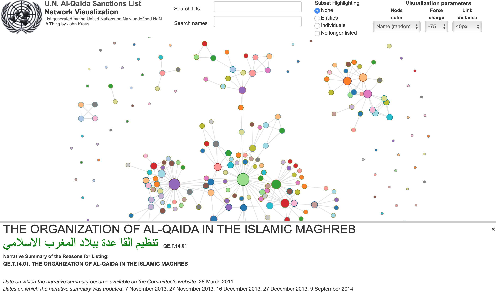

# aq-list-viz

## United Nations Al-Qaida Sanctions Visualization

Deployed Website: https://al-qaida-sanctions.com/

This application uses NodeJs and the [D3 JavaScript library](https://d3js.org/) to render a force-directed graph showing the relationships between individuals and entities from the public [United Nations Al-Qaida Sanctions List](https://www.un.org/securitycouncil/sanctions/1267). The [data](data/AQList.xml)
 is sourced from the U.N. website and transformed into JSON format for use in the visualization.

Hover over a graph node to view data on a sanctioned individual or organization:


Click on a graph node to see additional details regarding the sanction entity at the bottom of the screen:



To run this app on your local machine, follow these steps:

```shell
git clone https://github.com/johnfkraus/aq-list-viz.git

cd aq-list-viz

npm install

node index.js
```
Browse to localhost:3000.


