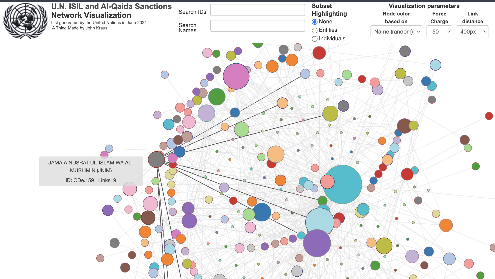
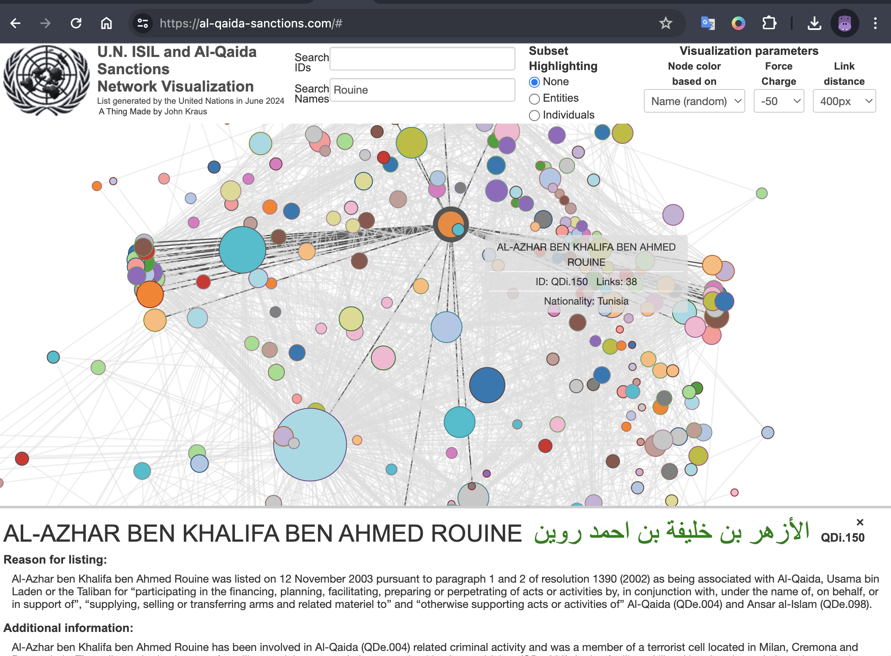

# aq-list-viz

## United Nations Al-Qaida Sanctions D3 Force-Directed Graph Visualization

Deployed Website: https://al-qaida-sanctions.com/

This application uses NodeJs and the [D3 JavaScript library](https://d3js.org/) to render a force-directed graph showing the relationships between individuals and entities from the public [United Nations Al-Qaida Sanctions List](https://www.un.org/securitycouncil/sanctions/1267). The [data](data/AQList.xml)
 is sourced from the U.N. website and transformed into JSON format for use in the visualization.

Hover over a graph node to view data on a sanctioned individual or organization:



Click on a graph node to see additional details regarding the sanction entity at the bottom of the screen:



To run this app on your local machine, follow these steps:

```shell
git clone https://github.com/johnfkraus/aq-list-viz.git

cd aq-list-viz

npm install

npm start
```
Browse to localhost:3000

## References

[United Nations Security Council Committee pursuant to resolutions 1267 (1999) 1989 (2011) and 2253 (2015) concerning Islamic State in Iraq and the Levant (Da’esh), Al-Qaida and associated individuals, groups, undertakings and entities](https://www.un.org/securitycouncil/sanctions/1267)


[ISIL (Da'esh) & Al-Qaida Sanctions List (HTML version)](
https://scsanctions.un.org/kh3uqen-al-qaida.html
)

[ISIL (Da'esh) & Al-Qaida Sanctions List (XML version)](
https://scsanctions.un.org/1z134en-al-qaida.xml
)


[Narrative Summaries of Reasons for Listing](
https://www.un.org/securitycouncil/sanctions/1267/aq_sanctions_list/summaries?type=All&page=4&order=field_posted_on&sort=desc)

https://www.un.org/securitycouncil/sanctions/1267/aq_sanctions_list/summaries?type=All&page=0&order=field_posted_on&sort=desc


